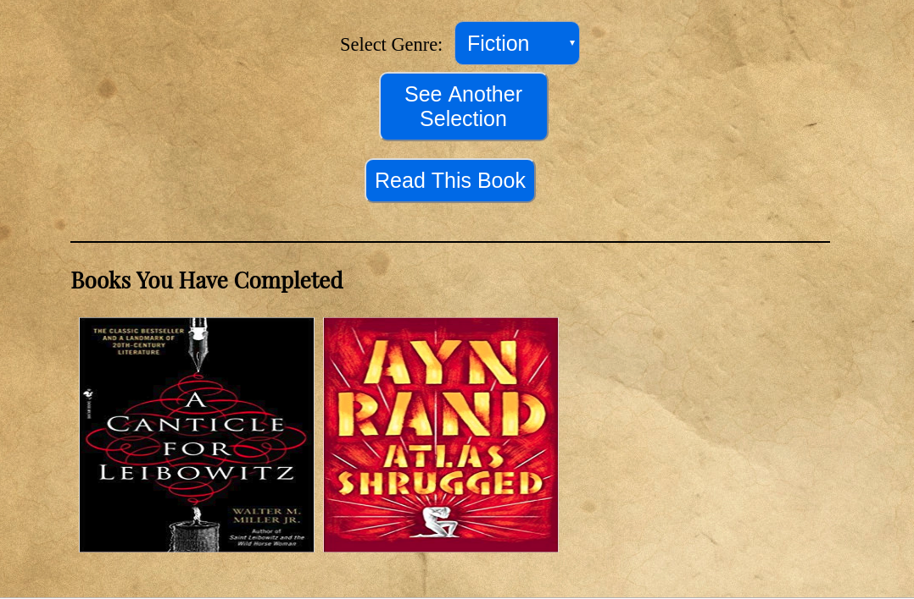

# Bibliomancer

Chris Carnivale

[Live App](https://cjcarnivale-bibliomancer-app.now.sh)
[Server Repo](https://github.com/cjcarnivale/bibliomancer-api)

## Summary
Bibliomancer provides recommendations for books to read based on a selected genre. It is for those undecisive people that want to read, but are unsure what to read.  It also tracks what books you have read from the recommendations given.

## Pages

#### Landing Page

Provides a description of what the app does and who it is for

Allows the user to test the functionality of the recommendations system

#### Demo Page

Allows the user to test the functionality of the recommendations system

Allows the user to test the functionality of keeping track of books they have marked as read

## Technology 
- HTML 
- CSS 
- Javascript 
- React

## Setup
1. Fork and clone the project to your machine
2. `npm install`
3. Start Server
4. `npm start`

## Tests
1. `npm test`

